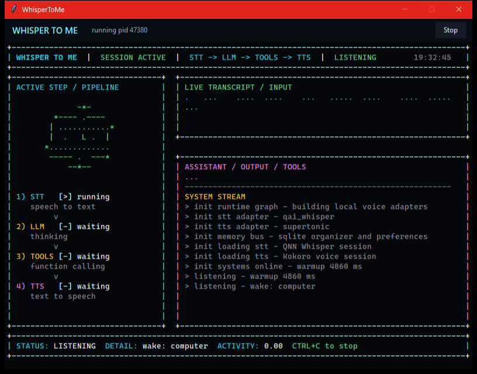

# WhisperToMe

A 24/7 local voice assistant for the desktop, optimized for the **Snapdragon X2 Elite**. Say
`computer`, keep talking: it hears you with local Whisper, thinks with a hosted LLM, and speaks
back with a local voice — with the whole speech stack running on the Hexagon NPU.

The design goal is an always-on assistant that stays efficient enough to run all day on a fanless
ARM laptop: speech models on the NPU (not the CPU), short spoken replies, and a UI that shows what
the system is doing.



## Core features

- **Always-listening wake loop** — continuous mic + VAD, sliding wake-phrase match, speech-pause
  command capture. Interrupt playback by speaking the wake word.
- **Speech on the NPU** — Whisper STT (Qualcomm AI Hub Whisper-Small) and Supertonic TTS both run
  on the Hexagon NPU via ONNX Runtime QNN HTP, under a strict no-CPU/GPU-fallback policy.
- **Swappable LLM** — OpenAI Responses or Cerebras, selectable at runtime; streaming text is fed to
  sentence-level TTS so replies start sooner.
- **Local memory** — SQLite organizer for notes, preferences, reminders, tasks, checklists,
  itinerary, projects, decisions, and people; active preferences are injected into the prompt.
- **Scheduled events** — reminders and recorded tool workflows that fire on their own at a time or
  recurrence (one-shot or repeating), executed deterministically.
- **Auto-compaction** — the conversation compacts after an idle hour or when context fills (a
  Codex-style, cache-aware token threshold), keeping long sessions fast.
- **Windows-native control** — volume, per-app ducking, brightness, desktop capture for vision,
  switch-to-window, browser search/maps, and guarded PowerShell.
- **Desktop UI** — an owned window + animated TUI: pipeline polygon, voice-reactive waveform, a
  live "next up" agenda chip, transcript/assistant panes, system stream, code viewport, and a tray.

## On the NPU

Production local inference is NPU-only — if a graph can't be placed on the QNN HTP NPU, the app
fails rather than quietly using CPU/GPU. Both halves of the speech stack meet that bar today.
Supertonic was the harder half: its source ONNX is dynamic-shaped, so the adapter static-fixes the
shapes and lets ONNX Runtime QNN compile a context binary on-device (cached after the first run),
reaching roughly 10x realtime. Kokoro remains available as a CPU debug voice (`--allow-non-npu`).

## How it's built

```text
src/whispertome/
  audio/      microphone, playback, VAD, ducking
  stt/        Whisper adapters (Qualcomm QNN Whisper-Small on the NPU)
  tts/        Supertonic (NPU) + Kokoro (CPU debug) adapters
  llm/        OpenAI + Cerebras providers, conversation + compaction
  agent/      local tool loop and tool registry
  organizer/  SQLite-backed memory and planning tools
  scheduler/  in-process scheduled events that fire (reminders + workflows)
  runtime/    NPU-only provider selection + async runtime event bus
  system/     Windows controls (volume, brightness, windows, PowerShell)
  wake/       wake-phrase detection and command routing
  ui/         animated terminal UI
  desktop/    owned Windows host window + tray
  pipeline.py / cli.py   the voice loop and commands
```

Each layer has its own boundary, which is what made it possible to swap providers, STT/TTS
backends, and UI surfaces without rewriting the loop.

## The journey, briefly

It started as a CPU debug loop to get the product working, then moved STT onto the verified
Qualcomm QNN Whisper-Small path for the X2 Elite. The long-running hard problem was NPU TTS — stock
Kokoro is blocked by QNN's dynamic-shape limits — which was solved by bringing Supertonic onto the
NPU via on-device context compilation. From there the work was autonomy and efficiency: scheduled
events, idle/usage auto-compaction, a latency + energy pass, and Windows-native actions. The full
milestone log lives in the [journey](research/journey.md).

## Quick start

Native ARM64 Python 3.12 with the QNN runtime extra, then run the desktop app (fully NPU):

```powershell
pip install -e .[qnn]
whispertome --project-root C:\Users\mreca\Desktop\whispertome desktop --wake "computer"
```

Add `--allow-non-npu` to fall back to the Kokoro CPU voice. Full setup, env vars, model paths, and
all commands are in [Getting Started](docs/GETTING_STARTED.md).

## More

- [Getting Started](docs/GETTING_STARTED.md) — setup, environment, commands
- [Project website](docs/index.html) — open directly in a browser, no build step
- [Journey](research/journey.md) — milestone-by-milestone wins, losses, and decisions
- [Notes](research/notes.md) — research scratch
